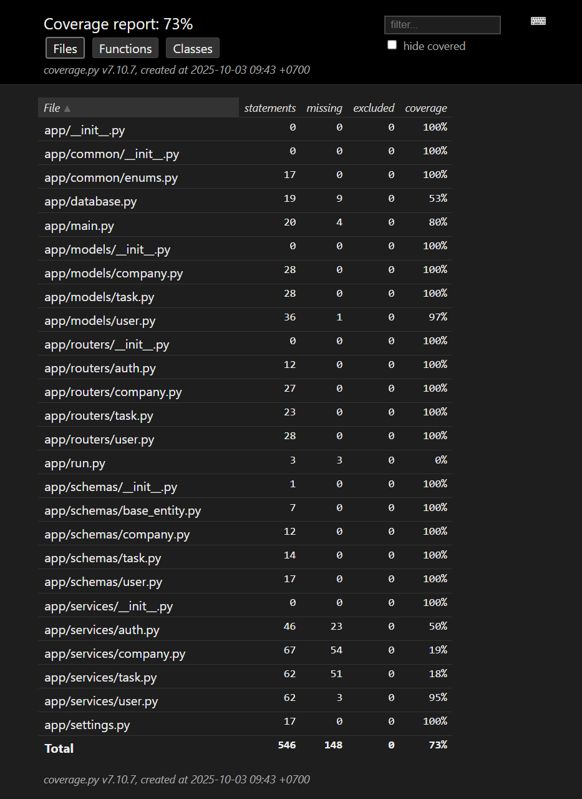

# 📊 Test Coverage



# 🚀 FastAPI + PostgreSQL Application

This is a FastAPI application with a PostgreSQL database, managed with Docker Compose.  
It includes database migrations via Alembic and JWT-based authentication.

---

## 📦 Prerequisites

Make sure you have installed:

- [Docker](https://docs.docker.com/get-docker/)
- [Docker Compose](https://docs.docker.com/compose/)

---

## ⚙️ Setup

1. **Clone the repository**
   ```bash
   git clone https://github.com/OngDuyThang/fast-api-2025-assignment.git
   ```

2. **Create your own .env file**
   ```bash
   cp .env.example .env
   ```
    Feel free to override your own environment variables

3. **Running the application**
   ```bash
   docker compose up --build
   ```
- The API will be available at: http://localhost:8000
- The interactive Swagger docs: http://localhost:8000/docs

---
